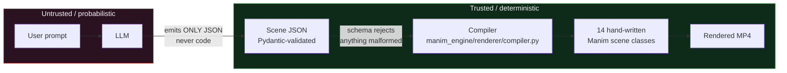
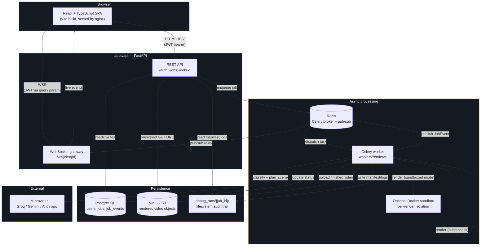
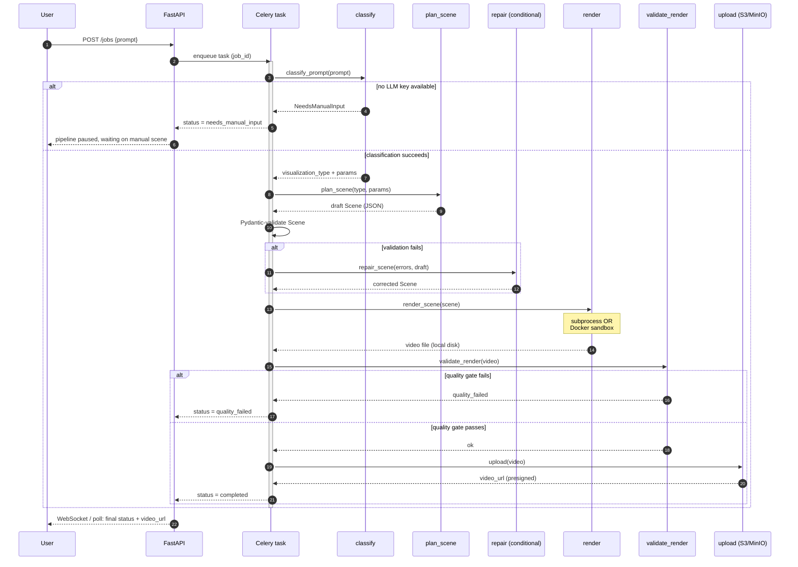
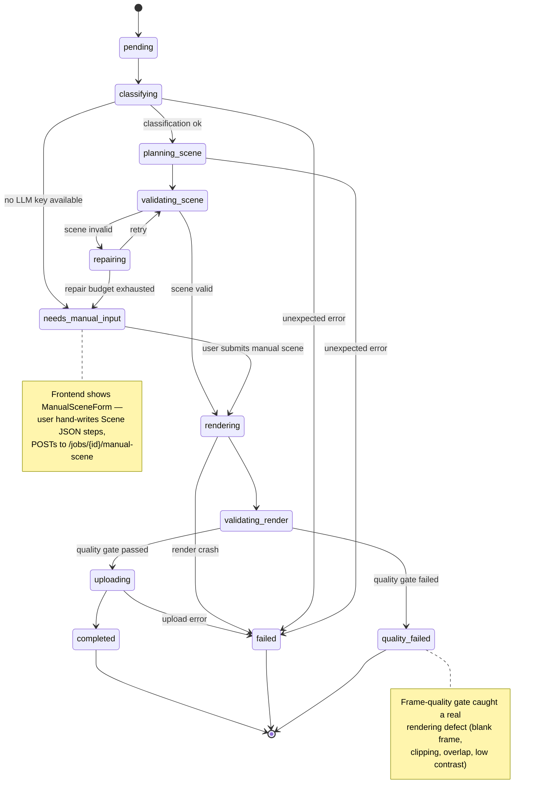
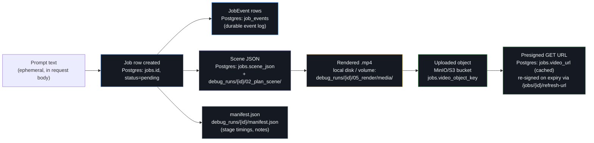
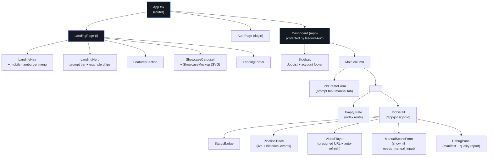
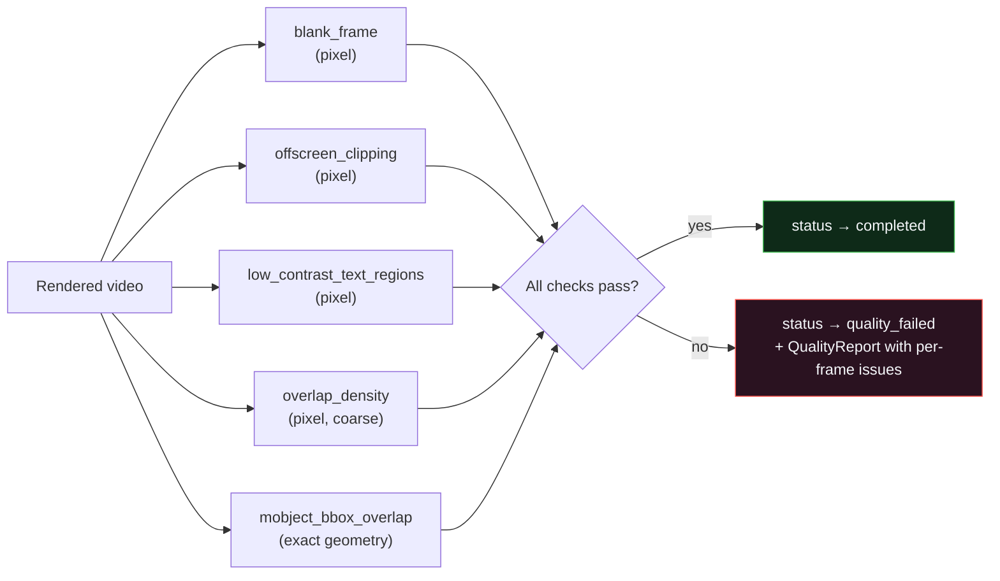

# Vizr — AI Algorithm Visualizer

Vizr turns a natural-language prompt (or a manually-specified algorithm +
input) into a polished, production-quality video visualizing that
algorithm — 14 templates spanning arrays, trees, graphs, hashmaps,
stacks, linked lists, and dynamic programming. Full auth, per-user job
isolation, S3-compatible video storage, optional per-render Docker
sandboxing, and a responsive web frontend with live pipeline visibility.

> Type "binary search for 42 in a sorted array" in, get a narrated MP4
> out — with a full audit trail of exactly how it was built along the
> way.

---

## Table of contents

- [Why this architecture](#why-this-architecture)
- [System architecture](#system-architecture)
- [The rendering pipeline](#the-rendering-pipeline)
- [Job lifecycle](#job-lifecycle)
- [Data flow: prompt to playable video](#data-flow-prompt-to-playable-video)
- [What's implemented](#whats-implemented)
- [Repository layout](#repository-layout)
- [Frontend](#frontend)
- [Running it](#running-it)
- [Debugging — granular, at every layer](#debugging--granular-at-every-layer)
- [Testing](#testing)
- [Current limitations (honest scope)](#current-limitations-honest-scope)
- [Future upgrades](#future-upgrades)
- [FAQ](#faq)

---

## Why this architecture

The core bet is **schema-driven, deterministic rendering**: an LLM never
writes Manim/Python code and never touches a rendering process directly.
It only ever emits a `Scene` — a Pydantic-validated JSON document built
from a closed vocabulary of ~26 actions (`set_pointer`, `highlight_range`,
`swap`, `visit_node`, `fill_dp_cell`, `push_stack`, ...). A hand-written
compiler (`manim_engine/renderer/compiler.py`) deterministically maps that
JSON to one of 14 hand-written, hand-tested Manim scene classes. This means:

- **No prompt injection / code-execution surface.** There's no code
  string from the LLM to sandbox, escape, or audit — just data,
  validated by Pydantic before it ever reaches a renderer. (The Docker
  sandbox and AST safety validator exist as defense-in-depth on top of
  this, not because the primary path needs them to be safe.)
- **Debuggable by construction.** Every layer (classification, scene
  planning, rendering, quality validation, upload) is a plain function
  you can call in isolation, log, and inspect — end to end, from the
  debug CLI to the production API to the web UI's debug panel.
- **Consistent visual quality.** Every visualization type shares the
  same component library (`manim_engine/components/`), so styling,
  boundary protection, and semantic coloring are enforced in one place.

The diagram below shows the core insight at a glance: the LLM's blast
radius is capped at "structured data," never "code."



---

## System architecture

Vizr is a fairly conventional async web stack: a React SPA talks to a
FastAPI backend, which enqueues work onto Celery workers backed by
Redis, with Postgres as the system of record and MinIO (S3-compatible)
for video storage. The only unusual piece is the **optional Docker
sandbox** the worker can spin up per-render for extra isolation.



**Why Celery + Redis instead of doing renders inline in the API
process?** Rendering a Manim scene takes anywhere from a few seconds to
over a minute of CPU-bound work (Cairo/Pango rasterization). Blocking an
HTTP request thread for that long doesn't scale and makes retries/error
handling much messier than "enqueue a task, poll or subscribe for
status." It also means the render fleet can be scaled independently of
the API (`docker compose up --scale worker=3`).

**Why WebSockets *and* polling?** The REST job-detail endpoint
(`GET /jobs/{id}`) is the source of truth and works even if the socket
never connects (corporate proxies, ancient browsers, flaky networks).
The WebSocket is a nice-to-have low-latency channel on top — the
frontend seeds its pipeline-trace view from
`GET /jobs/{id}/events` first (so a page reload doesn't show every
stage stuck on "pending"), then layers live socket events on top for
anything still in flight.

---

## The rendering pipeline

Every job — whether triggered from a natural-language prompt or a
manually-specified algorithm — runs through the same orchestrator
(`workers/renderer/pipeline/orchestrator.py`). This is the exact
function called by the Celery task in production, the debug CLI
locally, and the integration tests — there is only one pipeline
implementation, not a "real" one and a "test" one.



Every arrow in that diagram is also a row in `debug_runs/{job_id}/` —
see [Debugging](#debugging--granular-at-every-layer) below.

---

## Job lifecycle

A job moves through a fixed set of states (`apps/api/models/db.py::JobStatus`).
Most jobs go straight down the "happy path" on the left; the two
recoverable branches — `needs_manual_input` and the repair loop inside
`rendering` — exist specifically so a missing LLM key or a bad LLM
output doesn't have to mean total job failure.



---

## Data flow: prompt to playable video

A slightly different lens on the same system — this one follows the
actual bytes and records as they're created, to make clear what's
durable (survives a restart) versus what's ephemeral.



Note the deliberate separation between `video_path` (where the worker
wrote the file on local/volume disk) and `video_url` (the durable,
presigned S3 URL). A render can succeed even if the subsequent upload
temporarily fails — that's why `uploading` is its own status distinct
from `rendering`, and why a failed upload doesn't throw away a
perfectly good video file.

---

## What's implemented

| Area | Status |
|---|---|
| 14 algorithm templates | ✅ all render end-to-end, pass frame-quality gates |
| Schema-driven rendering (no LLM code-gen) | ✅ |
| Frame-quality debugging (blank/clipping/contrast/overlap) | ✅ |
| Spoken narration audio (English TTS, mixed into the MP4) | ✅ via edge-tts — free, no API key; degrades to captions-only if unreachable |
| Granular per-stage debug artifacts | ✅ |
| JWT auth, per-user job isolation | ✅ |
| S3/MinIO video storage | ✅ (tested against mocked S3; live MinIO needs a real run) |
| Docker-sandboxed rendering | ✅ (flag construction unit-tested; needs a live Docker host to fully verify) |
| Web frontend (React) | ✅ tested live against the real backend via Playwright |
| Responsive layout (mobile/tablet/desktop) | ✅ fluid grids, breakpoints on every page, mobile nav menu |
| Full async stack (FastAPI + Celery + Redis + Postgres) | ✅ |

### The 14 templates

| Category | Templates |
|---|---|
| Arrays | `array_traversal`, `two_sum`, `two_pointers`, `binary_search`, `sliding_window`, `bubble_sort`, `merge_sort`, `quicksort` |
| Trees & graphs | `binary_tree_traversal`, `graph_bfs_dfs` |
| Hash-based | `hashmap_ops` |
| Linked structures | `linked_list_reversal` |
| Stack-based | `valid_parentheses` |
| Dynamic programming | `dynamic_programming_1d` |

All 14 share the same component library
(`ArrayVisualizer`, `TreeVisualizer`, `GraphVisualizer`,
`HashMapVisualizer`, `StackVisualizer`, `DPTableVisualizer`,
`LinkedListVisualizer`, plus `PointerGroup`, `CodePanel`, `TitleBar`,
`CaptionBar`), so a `swap` action looks and animates identically
whether it appears in `bubble_sort` or `quicksort`.

---

## Repository layout

```
packages/scene_schema/       The Scene JSON contract (Pydantic models).
                              Closed action vocabulary + semantic bounds
                              checking. Single source of truth: same
                              schema validates LLM output, feeds the LLM's
                              own system prompt, and is the only input the
                              renderer compiler accepts.

manim_engine/
  components/                 Reusable Manim building blocks: ArrayVisualizer,
                               TreeVisualizer, GraphVisualizer, HashMapVisualizer,
                               StackVisualizer, DPTableVisualizer, LinkedListVisualizer,
                               PointerGroup, CodePanel, TitleBar, CaptionBar.
                               All boundary-protection / auto-sizing math lives
                               here (renderer/layout.py).
  templates/                   One Scene subclass per visualization_type (14
                               total): array_traversal, two_sum, two_pointers,
                               binary_search, sliding_window, bubble_sort,
                               merge_sort, quicksort, binary_tree_traversal,
                               graph_bfs_dfs, hashmap_ops, linked_list_reversal,
                               valid_parentheses, dynamic_programming_1d.
  renderer/                    config.py, layout.py, compiler.py,
                               validate_render.py (the quality gate),
                               ast_safety.py (defense-in-depth), sandbox.py +
                               sandbox_entrypoint.py (Docker isolation).
  debug/                       frame_quality.py (pixel + geometric frame
                               inspection), stage_logger.py + manifest.py
                               (granular per-stage debug artifacts).

workers/
  llm/client.py                Multi-provider LLM wrapper (Groq default,
                                Gemini, Anthropic). Per-request user API
                                keys, operator env-var fallback, no shared
                                default — pipeline pauses for manual input
                                if neither is present.
  pipeline/                    classify.py, plan_scene.py, repair.py, render.py,
                                orchestrator.py — plain functions over
                                dataclasses and the filesystem. Zero dependency
                                on FastAPI/Celery/Postgres, so the debug CLI
                                exercises the exact same code as production.
  tasks.py                      Celery task layer: bridges orchestrator results
                                to Postgres job rows, Redis pub/sub events, and
                                the S3/MinIO upload stage.

apps/api/
  auth/                         JWT creation/verification (python-jose), bcrypt
                                 password hashing, FastAPI auth dependencies.
  storage/s3_client.py           S3-compatible (MinIO by default) upload/
                                 presign/delete client.
  models/db.py                   SQLAlchemy models: User, Job (user-scoped),
                                 JobEvent.
  routers/                       auth.py, jobs.py (every route ownership-
                                 checked), debug.py (same, plus path-traversal
                                 guards).
  websocket/gateway.py            Live per-job event streaming, JWT-authenticated
                                 over the query string, ownership-checked before
                                 the socket is accepted.

apps/web/                       React + TypeScript + Vite frontend, fully
                                 responsive (mobile/tablet/desktop). A public
                                 landing page (/) with a stylized hero, prompt
                                 bar, and a static per-category showcase
                                 carousel, all routing "Get Started" into
                                 auth. Once signed in (/app), the same prompt
                                 or manual-input job creation, live
                                 pipeline-trace view, video playback with
                                 presigned-URL refresh, and a debug panel
                                 exposing the manifest/quality-report data.
                                 See "Frontend" section below for the
                                 component map and responsive-design notes.

debug_cli/run_pipeline.py      Standalone CLI: run any stage (or the whole
                                pipeline) with zero infrastructure.

tests/                         Schema, frame-quality, AST-safety, layout,
                                sandbox (mocked docker), S3 (mocked via moto),
                                and full end-to-end template-render
                                integration tests (marked `slow`).

infrastructure/docker/         Dockerfile (API/worker), Dockerfile.sandbox
                                (per-render isolation), Dockerfile.web
                                (frontend), init-db.sql.
docker-compose.yml              Full stack: postgres, redis, minio (+ init),
                                api, worker, sandbox-image-builder, web.
```

---

## Frontend

`apps/web/` is a React 19 + TypeScript + Vite single-page app, styled
with plain CSS (no framework) using a token-based dark theme
(`src/tokens.css`) that deliberately reuses the exact color palette
Manim renders with, so the tool's own chrome visually rhymes with the
videos it produces.

### Component map



### Responsive design

Every page adapts fluidly across phone, tablet, and desktop widths —
there is no separate "mobile site," just CSS that reflows the same
markup:

- **Landing nav** collapses into an animated hamburger menu below
  860px (full-height slide-down panel, body-scroll lock while open,
  auto-closes if the viewport is resized back past the breakpoint).
- **Dashboard app shell** is a two-column grid (sidebar + main) down to
  860px, then stacks vertically; the job-history list gets its own
  capped, independently-scrolling region on small screens so a long
  history can't push the create-form off-screen.
- **Hero, features, and showcase sections** use `clamp()` for
  fluid type scaling and CSS grid `auto-fit`/breakpoint reflows rather
  than fixed pixel layouts, so they hold up from ~320px phones through
  ultra-wide desktop monitors.
- **Tables and long monospace content** (the debug panel's stage-timing
  table, pipeline error messages) scroll horizontally in their own
  container or wrap, instead of overflowing the viewport.
- **All text inputs and textareas** are set to a 16px minimum font size
  specifically to prevent iOS Safari's automatic zoom-on-focus behavior,
  which is a common and easy-to-miss mobile-web papercut.
- The video player reserves a 16:9 `aspect-ratio` box so the layout
  doesn't jump while a video's metadata is still loading on a slow
  connection.

You can exercise every breakpoint locally with Chrome/Firefox DevTools'
device toolbar, or just resize the window — nothing requires a
device-specific build.

### State & data hooks

- `hooks/useAuth.tsx` — auth context (login/signup/logout, JWT stored
  client-side, attached as a bearer token to every API call).
- `hooks/useJobPolling.ts` — polls `GET /jobs/{id}` at an interval until
  the job reaches a terminal status.
- `hooks/useJobEvents.ts` — opens the `/ws/jobs/{id}` WebSocket while a
  job is active; closes automatically once terminal.

---

## Running it

### Fastest path: no infrastructure at all

```bash
pip install -r requirements.txt

python debug_cli/run_pipeline.py validate-scene --scene-file my_scene.json
python debug_cli/run_pipeline.py from-scene --scene-file my_scene.json --job-id demo1
python debug_cli/run_pipeline.py inspect --job-id demo1
cat debug_runs/demo1/manifest.json
```

### Full stack (recommended)

```bash
cp .env.example .env
# edit .env: set JWT_SECRET_KEY (openssl rand -hex 32), optionally GROQ_API_KEY
docker compose up --build
```

This starts Postgres, Redis, MinIO (with bucket auto-created), the
sandbox image build, the API on `:8000`, the worker, and the web
frontend on `:5173`. Open `http://localhost:5173`, sign up, and create
a job. The frontend is fully responsive, so this also works fine from
a phone or tablet on the same network if you point it at your machine's
LAN IP instead of `localhost`.

### Frontend-only local dev (hot reload)

If you're iterating on `apps/web/` specifically and already have the
API running elsewhere (via `docker compose up api worker db redis
minio minio-init`, or a remote deployment):

```bash
cd apps/web
npm install
npm run dev        # Vite dev server with HMR, defaults to :5173
npx tsc -b          # typecheck
npm run build       # production build → dist/
npx oxlint          # lint
```

Set `VITE_API_BASE_URL` (in `apps/web/.env` or your shell) to point the
dev server at the right API origin if it isn't `http://localhost:8000`.

### Auth

```bash
curl -X POST localhost:8000/auth/signup -d '{"email":"you@example.com","password":"..."}' -H 'Content-Type: application/json'
curl -X POST localhost:8000/auth/login/json -d '{"email":"you@example.com","password":"..."}' -H 'Content-Type: application/json'
# -> {"access_token": "...", "token_type": "bearer"}
curl localhost:8000/jobs -H "Authorization: Bearer <token>"
```

Every job, debug endpoint, and WebSocket connection is scoped to the
authenticated user — accessing another user's job returns 404, not 403,
so existence isn't leaked either.

### Getting a free LLM API key (for local development)

The classify and plan-scene stages need an LLM. Three providers are
supported; **Groq is the default** because it's the fastest to set up:

| Provider | Free tier | Setup time | Get a key |
|---|---|---|---|
| **Groq** (default) | Yes, generous, no credit card | ~30 seconds | [console.groq.com/keys](https://console.groq.com/keys) — sign in with Google/GitHub, click "Create API Key" |
| **Gemini** | Yes, no credit card | ~1 minute | [aistudio.google.com/apikey](https://aistudio.google.com/apikey) — sign in with a Google account, click "Create API key" |
| Anthropic | No free tier | — | [console.anthropic.com/settings/keys](https://console.anthropic.com/settings/keys) |

**Fastest path while developing**: paste your key into `.env` as
`GROQ_API_KEY=gsk_...` (or `GEMINI_API_KEY=...`) before
`docker compose up` — every job then uses it automatically with no
per-request key needed. This is an operator-level fallback meant for
your own local development, not something you'd leave set in a real
shared deployment.

**Per-request path** (what end users of a real deployment see): the
frontend's job-creation form has a "LLM provider & API key" section
where anyone can pick Groq/Gemini/Anthropic and paste their own key for
that one request — nothing server-side is required, and the key is only
sent with that job's request, never stored server-side. The frontend
also remembers your choice per-provider in the browser's local storage
(namespaced `vizr_llm_provider` / `vizr_llm_key_{provider}`) so you
don't have to re-paste it every time while testing locally.

If neither a per-request key nor an operator fallback is available, the
job pauses at `needs_manual_input` and can be resumed via
`POST /jobs/{id}/manual-scene` with hand-written steps instead of
failing outright.

---

## Debugging — granular, at every layer

**Every job produces a full audit trail** at `debug_runs/{job_id}/`:
classify/plan_scene/render/validate_render inputs, outputs, and timing;
`manifest.json` (per-stage summary); `pipeline.log` (structured event
stream). The exact same data is available:

- Via the debug CLI: `python debug_cli/run_pipeline.py inspect --job-id X`
- Via HTTP: `GET /debug/jobs/{id}/manifest`, `/quality-report`, `/stages`
- **In the web UI**: every job page has a "Debug details" panel showing
  stage timings and frame-quality results pulled live from the backend
  (rendered in a horizontally-scrollable table on small screens), and a
  pipeline-trace view showing exactly which stage failed and why.

**Frame-quality checks** (`manim_engine/debug/frame_quality.py`) gate
whether a render can reach `completed`:

- `blank_frame`, `offscreen_clipping`, `low_contrast_text_regions` — pixel-based
- `overlap_density` — pixel-based, coarse (documented blind spot for thin strokes)
- `mobject_bbox_overlap` — **exact** geometric check on Manim's own
  coordinates; this one found every real layout bug during development

Run it standalone: `python debug_cli/run_pipeline.py check-frames --video path/to/video.mp4`



---

## Testing

```bash
pytest tests/ -m "not slow"     # fast: schema, frame-quality, AST, layout, sandbox, S3 (~60 tests, <15s)
pytest tests/ -m slow           # slow: full render of all 14 templates (~40s)
pytest tests/                   # everything

cd apps/web && npx tsc --noEmit && npm run build   # frontend typecheck + build
```

The frontend build has also been manually verified against every major
breakpoint (mobile ≈360–480px, tablet ≈768–1024px, desktop ≥1280px)
during development; see [Current limitations](#current-limitations-honest-scope)
for what that manual verification does and doesn't cover.

---

## Current limitations (honest scope)

This section is deliberately specific about what has and hasn't been
directly verified, rather than implying blanket confidence.

**Backend / infrastructure**

- **Docker sandbox**: flag construction and result-parsing are
  unit-tested (mocked `docker run`), but this development environment
  has no Docker daemon, so a live render through the sandbox hasn't
  been directly observed here. Falls back to subprocess mode
  automatically if the sandbox image isn't available — verify the
  sandboxed path specifically before depending on its isolation
  guarantees in production.
- **S3/MinIO**: the client is tested thoroughly against a mocked S3
  protocol server (moto), and the pipeline's upload stage has been
  exercised against an intentionally-unreachable endpoint to confirm
  graceful failure — but not against a live MinIO container in this
  environment (no Docker here to run one).
- `overlap_density`'s pixel-statistics approach has a documented blind
  spot for thin strokes — `mobject_bbox_overlap` is authoritative.
- No refresh-token rotation — access tokens expire (30 min default) and
  require re-login; no revocation list.
- No rate limiting on auth endpoints.
- No horizontal scaling guidance beyond "add more `worker` replicas" —
  there's no autoscaling policy, queue-depth-based scaling, or
  multi-region deployment story.
- No database migration tool (Alembic) wired in yet —
  `init_db()` calls `Base.metadata.create_all`, which is fine for a
  fresh install but doesn't handle schema evolution on an existing
  database.

**Frontend**

- **No automated frontend test suite** beyond TypeScript's type checker
  (`tsc -b`) and manual Playwright-driven verification done during
  development (which did catch one real backend routing bug — see git
  history / code comments in `apps/api/routers/jobs.py`). There is no
  component-level unit testing (e.g. React Testing Library) or
  automated end-to-end suite committed to the repo.
- **Responsive design has been verified visually and via DevTools
  device emulation**, not on a matrix of real physical devices. Known
  untested edge cases: foldable-device hinge behavior, very old Android
  WebView browsers, and landscape orientation on small phones for the
  video-player-heavy `JobDetail` page.
- **No dark/light theme toggle** — the app is dark-mode-only by design
  (matching the rendered videos' own palette), which won't suit every
  user's system preference or accessibility need around contrast.
- **No offline support / PWA manifest** — the app requires a live
  network connection at all times; there's no service worker caching
  or offline fallback UI.
- **No internationalization (i18n)** — all UI strings are hardcoded
  English with no translation layer.
- Accessibility has focus-visible states and semantic landmarks
  (`nav`, `aria-label`s, `role="list"` on the pipeline trace) but has
  not been audited against WCAG with a screen reader end-to-end.
- The example showcase carousel on the landing page uses static SVG
  mockups, not real rendered output — a first-time visitor doesn't see
  an actual Vizr-generated video until they create one themselves.

---

## Future upgrades

Roughly ordered by expected impact-to-effort ratio, not commitment or
sequencing — this is a wishlist, not a roadmap with dates.

```mermaid
flowchart TD
    subgraph Now["Solid foundation (done)"]
        N1["Schema-driven rendering"]
        N2["14 templates"]
        N3["Full async stack"]
        N4["Responsive frontend"]
    end

    subgraph Near["Near-term"]
        T1["Refresh-token rotation<br/>+ auth rate limiting"]
        T2["Alembic migrations"]
        T3["Frontend test suite<br/>(Vitest + RTL, Playwright CI)"]
        T4["Verified live Docker sandbox<br/>+ live MinIO run"]
        T5["Light theme / high-contrast mode"]
    end

    subgraph Mid["Mid-term"]
        M1["More templates:<br/>heaps, tries, union-find,<br/>segment trees, backtracking"]
        M2["Editable scene timeline<br/>(scrub, trim, re-order steps)"]
        M3["Shareable public video links<br/>+ embeddable player"]
        M4["Queue-depth-based<br/>worker autoscaling"]
        M5["PWA / offline shell"]
    end

    subgraph Later["Longer-term / exploratory"]
        L1["Multi-language narration<br/>(TTS + i18n UI)"]
        L2["User-uploaded custom<br/>component library"]
        L3["Collaborative editing<br/>of manual scenes"]
        L4["Self-serve template SDK<br/>for third-party algorithm types"]
    end

    Now --> Near --> Mid --> Later

    style Now fill:#0e2a18,stroke:#3fb950,color:#f5f7fa
    style Near fill:#1b2230,stroke:#4c9aff,color:#f5f7fa
    style Mid fill:#241a02,stroke:#d29922,color:#f5f7fa
    style Later fill:#2a1220,stroke:#8b7cf6,color:#f5f7fa
```



### Near-term

- **Refresh-token rotation and auth rate limiting** — closes the two
  most concrete gaps called out in [Current limitations](#current-limitations-honest-scope).
- **Alembic migrations** — replace `create_all`-on-boot with real,
  versioned schema migrations so production databases can evolve
  safely.
- **Automated frontend test suite** — component tests (Vitest + React
  Testing Library) for the interactive pieces (`JobCreateForm`,
  `PipelineTrace`, `DebugPanel`), plus a Playwright suite committed to
  CI instead of run manually during development.
- **Verified live Docker sandbox + MinIO runs** — spin up an actual
  Docker-enabled CI runner to close the "unit-tested but not
  live-observed" gap on both the sandbox and object storage paths.
- **Light theme / high-contrast mode** — an accessibility- and
  preference-driven addition; the current dark-only palette is a
  deliberate aesthetic choice, not a technical constraint, so this is
  mostly a design-system exercise (extending `tokens.css` with a
  `[data-theme="light"]` variant).

### Mid-term

- **More algorithm templates** — heaps/priority queues, tries,
  union-find (disjoint set), segment trees, and backtracking
  (N-Queens, subsets) are natural next additions to the existing 14,
  each following the same "Scene action vocabulary + hand-written
  Manim template" pattern.
- **Editable scene timeline** — let a user scrub through, trim, or
  reorder the planned `Scene` steps before rendering, rather than only
  being able to accept the LLM's plan wholesale or hand-write JSON from
  scratch via `ManualSceneForm`.
- **Shareable public video links** — a public, unauthenticated
  `/watch/{token}` route and an embeddable `<iframe>` player, so a
  finished video can be shared outside the authenticated dashboard.
- **Queue-depth-based worker autoscaling** — replace "manually run
  `--scale worker=N`" with a Celery-queue-length-driven autoscaler
  (e.g. KEDA on Kubernetes, or a simple queue-depth-polling script for
  Docker Compose/Swarm deployments).
- **PWA / offline shell** — a service worker for asset caching and a
  proper offline fallback screen, so a flaky connection degrades
  gracefully instead of just failing requests.

### Longer-term / exploratory

- **Multi-language narration** — spoken narration now ships (English,
  via edge-tts — see `workers/renderer/pipeline/audio.py`); extending it
  to other languages just means picking a per-language voice, paired
  with a translated UI (a real i18n layer, not just hardcoded strings).
- **User-uploaded custom components** — a plugin surface for someone to
  register their own Manim component (beyond the built-in
  `ArrayVisualizer`/`TreeVisualizer`/etc. set) without forking the
  engine.
- **Collaborative editing of manual scenes** — real-time multi-cursor
  editing of a `Scene`'s JSON steps (à la Google Docs), useful for pair
  debugging a `needs_manual_input` job.
- **Self-serve template SDK** — a documented contract + scaffolding CLI
  so a third party could add a 15th, 16th, ... visualization type
  without touching the core renderer, effectively turning
  `manim_engine/templates/` into an extensible registry instead of a
  fixed list.

---

## FAQ

**Why "Vizr" and not something else?**
Short, pronounceable, and unambiguous about what the product does —
visualize algorithms — without colliding with the many existing tools
already named some variant of "visualizer" or "algo-viz."

**Does Vizr call an LLM at render time, or just at planning time?**
Only at planning time — `classify` and `plan_scene` are the only two
stages that touch an LLM. Once a `Scene` is validated, rendering is
100% deterministic and involves no further model calls, which is also
why the exact same video is reproduced if you re-render an existing,
already-validated `Scene`.

**Can I self-host this without Docker?**
Yes — see [Fastest path: no infrastructure at all](#fastest-path-no-infrastructure-at-all).
The debug CLI exercises the full pipeline (LLM calls included, if you
export an API key as an environment variable) against your local
filesystem with no Postgres, Redis, or MinIO required. You lose auth,
multi-user isolation, and the web UI in that mode — it's meant for
pipeline development and debugging, not as a lightweight production
deployment option.

**Is the frontend usable on a phone right now, or is that future work?**
It's usable today — the responsive-design work described in
[Frontend](#frontend) is already merged, not on the roadmap. The
[Future upgrades](#future-upgrades) list's frontend items (PWA/offline,
light theme, i18n) are genuinely separate, additive improvements on top
of an already-responsive baseline, not fixes for things that are
currently broken on mobile.
